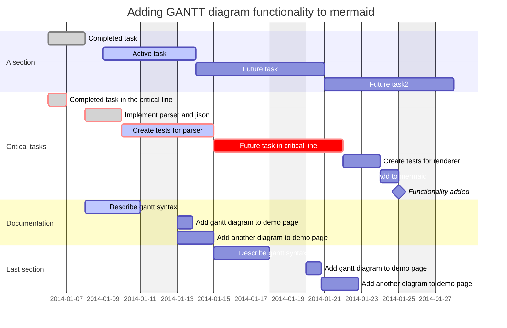

# text-tests

```mermaid
  info
```

## Mermaid diagram?



## Mermaid 2

```mermaid
flowchart LR
    FUK(福岡) --- YGT(山口)
    SAG(佐賀) --- FUK
    NGS() --- SAG
    FUK --- KMT(熊本)
    SAG --- KMT
    KMT --- ASO(麻生)
    ASO --- TCH(高千穂)
    TCH --- MYZ(宮崎)
    KMT --- KGS(鹿児島)
    KGS --- YKS(屋久島)
    KGS --- MYZ
    FUK --- YKS
    OKN(沖縄) --- FUK
    OKN --- KMT
    OKN --- KGS
    OKN --- MYZ
    ISG(石垣) --- FUK
    ISG --- OKN
    style KMT color:#aaa
    style KGS color:#aaa
    style MYZ color:#aaa
```
