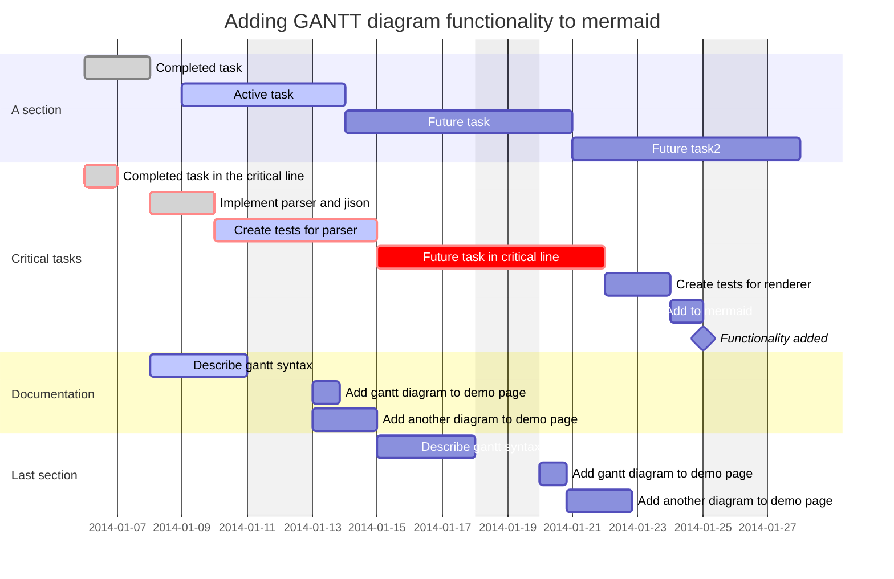
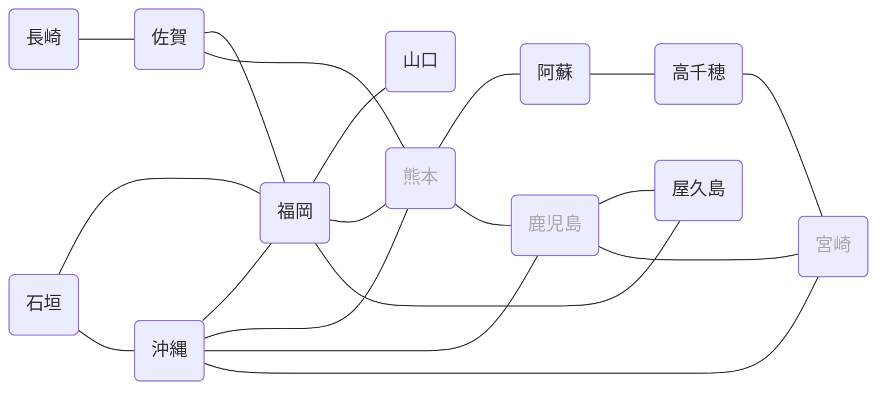
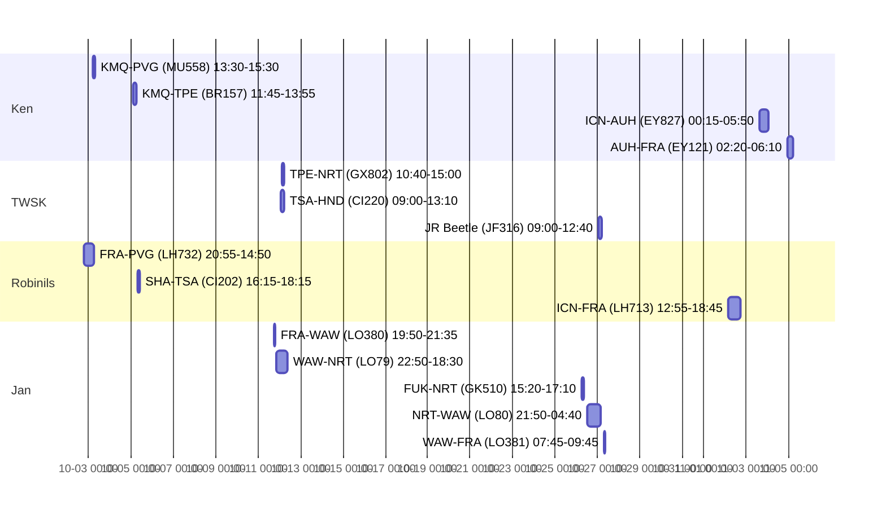
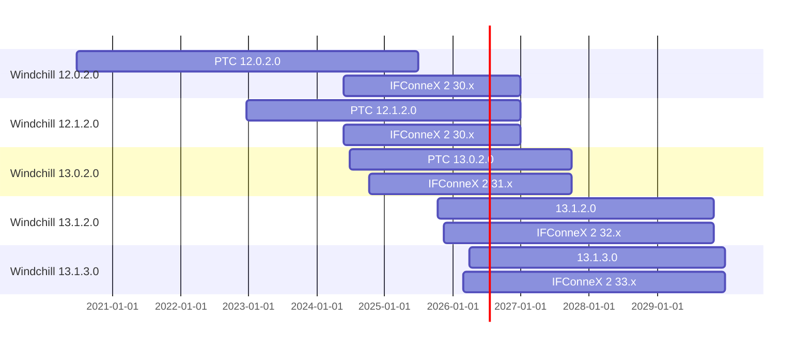

# text-tests

```mermaid
  info
```

## Mermaid diagram?

```mermaid
gantt
    dateFormat  YYYY-MM-DD
    title       Adding GANTT diagram functionality to mermaid
    excludes    weekends
    %% (`excludes` accepts specific dates in YYYY-MM-DD format, days of the week ("sunday") or "weekends", but not the word "weekdays".)

    section A section
    Completed task            :done,    des1, 2014-01-06,2014-01-08
    Active task               :active,  des2, 2014-01-09, 3d
    Future task               :         des3, after des2, 5d
    Future task2              :         des4, after des3, 5d

    section Critical tasks
    Completed task in the critical line :crit, done, 2014-01-06,24h
    Implement parser and jison          :crit, done, after des1, 2d
    Create tests for parser             :crit, active, 3d
    Future task in critical line        :crit, 5d
    Create tests for renderer           :2d
    Add to mermaid                      :until isadded
    Functionality added                 :milestone, isadded, 2014-01-25, 0d

    section Documentation
    Describe gantt syntax               :active, a1, after des1, 3d
    Add gantt diagram to demo page      :after a1  , 20h
    Add another diagram to demo page    :doc1, after a1  , 48h

    section Last section
    Describe gantt syntax               :after doc1, 3d
    Add gantt diagram to demo page      :20h
    Add another diagram to demo page    :48h
```

## Mermaid 2

```mermaid
flowchart LR
    FUK(福岡) --- YGT(山口)
    SAG(佐賀) --- FUK
    NGS(長崎) --- SAG
    FUK --- KMT(熊本)
    SAG --- KMT
    KMT --- ASO(阿蘇)
    ASO --- TCH(高千穂)
    TCH --- MYZ(宮崎)
    KMT --- KGS(鹿児島)
    KGS --- YKS(屋久島)
    KGS --- MYZ
    FUK --- YKS
    OKN(沖縄) --- FUK
    OKN --- KMT
    OKN --- KGS
    OKN --- MYZ
    ISG(石垣) --- FUK
    ISG --- OKN
    style KMT color:#aaa
    style KGS color:#aaa
    style MYZ color:#aaa
```

## Mermaid Gantt

```mermaid
gantt
    dateFormat YYYY-MM-DD HH:mm
    axisFormat %m-%d %H:%M

section Ken
    KMQ-PVG (MU558) 13#colon;30-15#colon;30 : 2024-10-03 04:30, 2024-10-03 07:30
    KMQ-TPE (BR157) 11#colon;45-13#colon;55 : 2024-10-05 02:45, 2024-10-05 05:55

    ICN-AUH (EY827) 00#colon;15-05#colon;50 : 2024-11-03 15:15, 2024-11-04 01:50
    AUH-FRA (EY121) 02#colon;20-06#colon;10 : 2024-11-04 22:20, 2024-11-05 05:10

section TWSK
    TPE-NRT (GX802) 10#colon;40-15#colon;00 : 2024-10-12 02:40, 2024-10-12 06:00
    TSA-HND (CI220) 09#colon;00-13#colon;10 : 2024-10-12 01:00, 2024-10-12 05:10

    JR Beetle (JF316) 09#colon;00-12#colon;40 : 2024-10-27 00:40, 2024-10-27 04:40

section Robinils
    FRA-PVG (LH732) 20#colon;55-14#colon;50 : 2024-10-02 18:55, 2024-10-03 06:50
    SHA-TSA (CI202) 16#colon;15-18#colon;15 : 2024-10-05 08:15, 2024-10-05 10:15
    ICN-FRA (LH713) 12#colon;55-18#colon;45 : 2024-11-02 03:55, 2024-11-02 17:45

section Jan
    FRA-WAW (LO380) 19#colon;50-21#colon;35 : 2024-10-11 17:50, 2024-10-11 19:35
    WAW-NRT (LO79) 22#colon;50-18#colon;30 : 2024-10-11 20:50, 2024-10-12 09:30
    FUK-NRT (GK510) 15#colon;20-17#colon;10 : 2024-10-26 06:20, 2024-10-26 08:10
    NRT-WAW (LO80) 21#colon;50-04#colon;40 : 2024-10-26 12:50, 2024-10-27 03:40
    WAW-FRA (LO381) 07#colon;45-09#colon;45 : 2024-10-27 06:45, 2024-10-27 08:45
```

## Gantt

gantt

```mermaid
gantt
    dateFormat YYYY-MM-DD

section Windchill 12.0.2.0
    PTC 12.0.2.0 : 2020-06-23, 2025-06-30
    IFConneX 2 30.x : 2024-05-27, 2026-12-31

section Windchill 12.1.2.0
    PTC 12.1.2.0 : 2022-12-19, 2026-12-31
    IFConneX 2 30.x : 2024-05-27, 2026-12-31

section Windchill 13.0.2.0
    PTC 13.0.2.0 : 2024-06-28, 2027-09-30
    IFConneX 2 31.x : 2024-10-10, 2027-09-30

section Windchill 13.1.2.0
    13.1.2.0 : 2025-10-13, 2029-10-31
    IFConneX 2 32.x : 2025-11-15, 2029-10-31

section Windchill 13.1.3.0
    13.1.3.0 : 2026-03-31, 2029-12-31
    IFConneX 2 33.x : 2026-02-28, 2029-12-31
```
